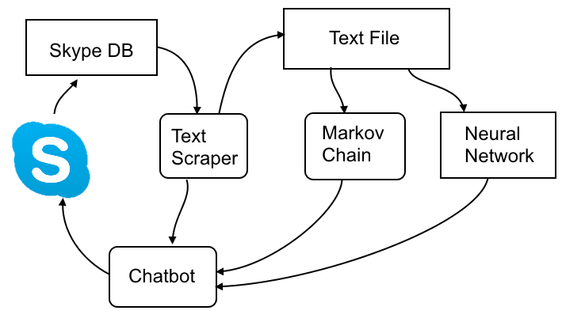

# SlagathorBot
## Overview
The ultimate goal of this project is to be a chat-bot that can be interacted with in a skype group chat or similar format. Ultimately, the idea is to train a neural network using a corpus of messages, and then have the neural network interfaced with a skype account so that it can add messages to a chat or respond to being directly addressed. There will be several stages to this project, each of which is broken out as a module in it's own subfolder of this main repository. The components are listed below:

Wolframhart - Let me know what you think about the way the project is structured. You've probably got more experience with this, so idk if it's a good way to organize it or not. And let me know what you think about anything else

## Components

* textScraper - module that gets the chats from the Skype database and puts them into a text file. Ultimately, it might be useful to make a library which could be resued by the chatbot component to query the db to check for new messages, in which case renaming the module might be a good idea.
* markovChain - text generation using a Markov Chain. The idea is to train a Markov Chain using the text file generated by the textScraper, i.e. train it on all of the messages.
* neuralNet - text generation using a Neural Network. Same idea as the Markov Chain, just using a neural net this time
* chatBot - interface between skype and the text generated by the Markov Chain or Neural Net. Might listen for it's name, or interject occasionally
